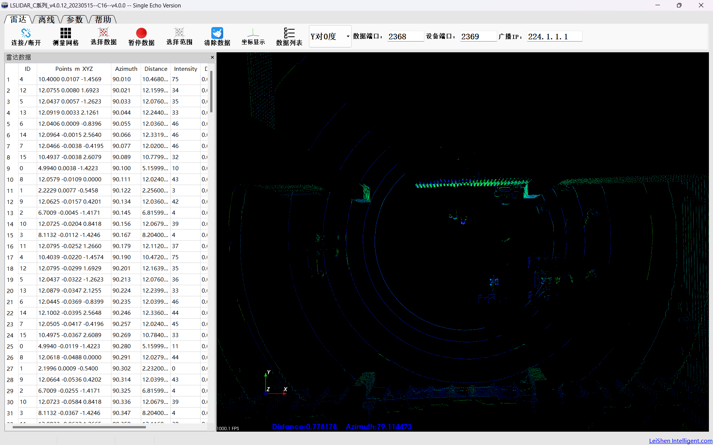
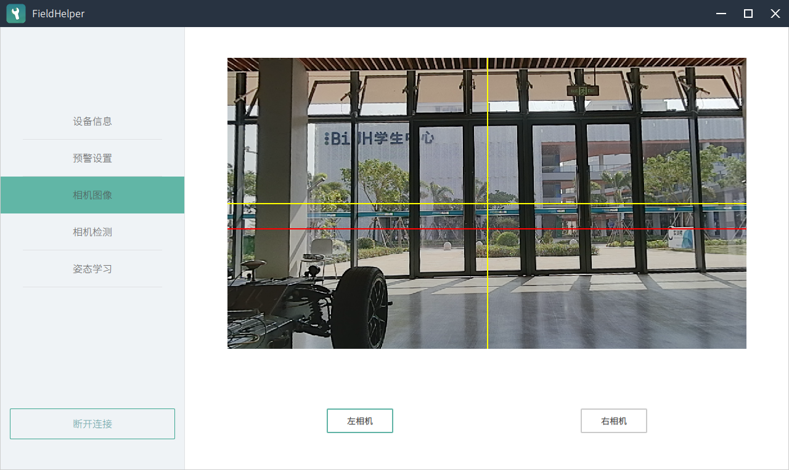
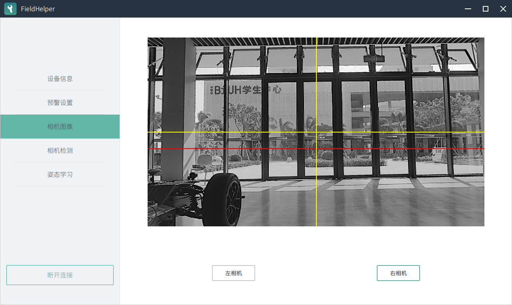
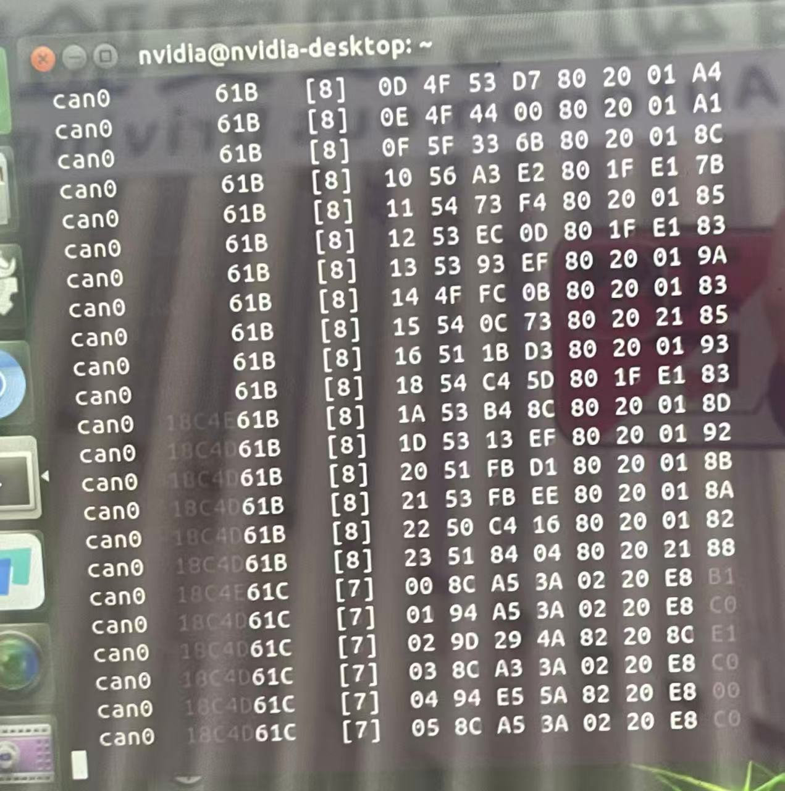
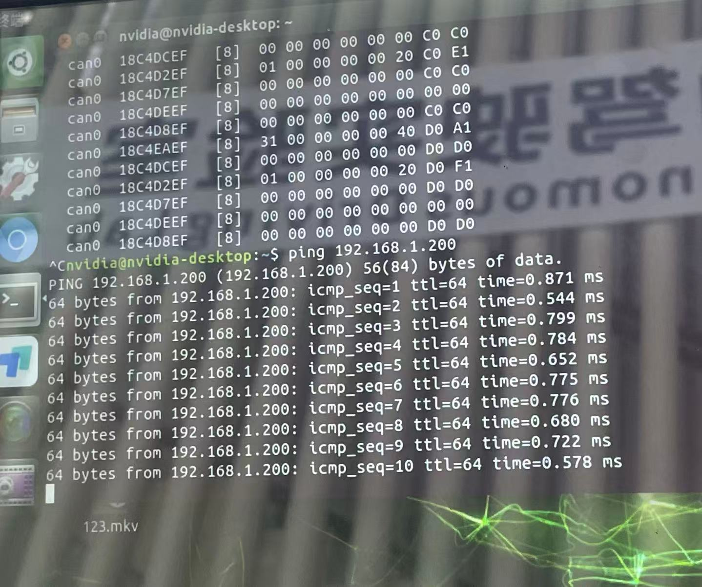
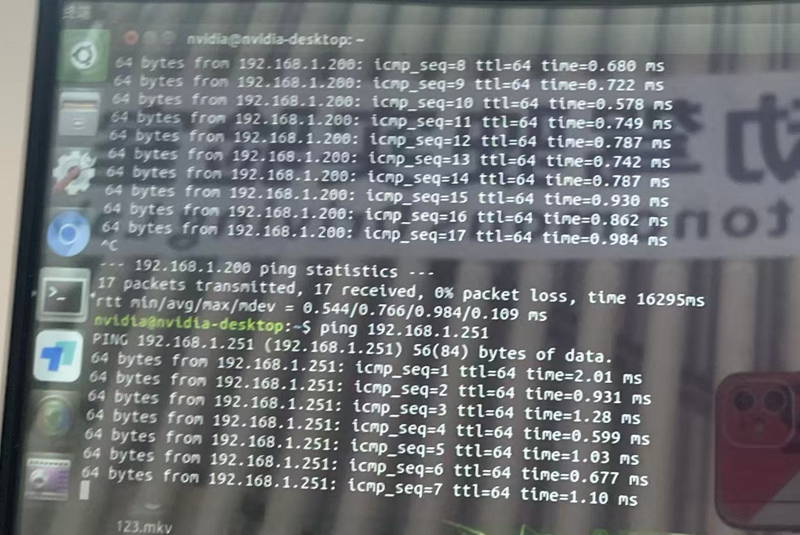

# Week6实验报告
## 一、实训任务
- Windows上位机初步检测
- Docker宿主机底层通讯巡检
---
## 二、实践步骤
### 1. Windows上位机初步检测 
### 2. Docker宿主机底层通讯巡检  
# Windows上位机初步检测与Docker宿主机底层通讯巡检操作步骤
## 一、Windows上位机初步检测
### （一）前置准备
1. 硬件连接：用网线将Windows笔记本与车辆传感器（激光雷达、双目相机）连接。
2. IP配置：设置笔记本静态IP为192.168.1.102，具体步骤如下：
    - 右键点击任务栏右下角网络图标，选择“网络和Internet设置”。
    - 进入“以太网”页面，若当前IPv4地址非192.168.1.102，点击“编辑”（IP分配方式切换为“手动”）。
    - 按以下参数配置IPv4：
     
| 配置项       | 数值           |
|--------------|----------------|
| IP地址       | 192.168.1.102  |
| 子网掩码     | 255.255.255.0  |
| 网关         | 192.168.1.1    |
| 首选DNS      | 8.8.8.8       |

   -  保存设置，确认IP地址已更新。
3. 设备状态：关闭车辆工控机`sudo poweroff`，关闭Windows防火墙。

### （二）激光雷达（LiDAR）检测
1. 启动软件：打开LSLIDAR上位机。
2. 建立连接：点击界面左上角“连接”按钮。
3. 状态校验：
    - 观察实时点云是否完整覆盖360°环境。
    - 确认点云画面无卡顿、无断层。
4. 操作限制：仅查看数据，严禁修改软件参数。

### （三）双目相机（Camera）检测
1. 软件登录：打开FieldHelper工具，选择“离线登录”。
2. 设备连接：
    - 点击“连接设备”，输入相机IP地址192.168.1.251。
    - 等待连接成功后自动跳转至设备界面。
3. 画面校验：
    - 查看左/右目相机实时图像，确认视野正常。
    - 检查无黑屏、无明显卡顿或画面失真。
4. 后续操作：使用完上位机软件后，整车断电并重新上电（确保CAN卡正常启动）。

## 二、Docker宿主机底层通讯巡检
### （一）宿主机（Docker外）检测
1. 环境准备：启动车辆工控机，进入Ubuntu系统。
2. CAN总线检测：
    - 打开Ubuntu终端，执行命令：`candump can0`。
    - 验证标准：终端需显示持续跳动的数据帧，且包含至少两种不同CAN ID。
3. 网络连通性检测：
    - 激光雷达连通性：执行`ping 192.168.1.200`，确认数据包正常响应。
    - 双目相机连通性：执行`ping 192.168.1.251`，验证标准同上。
